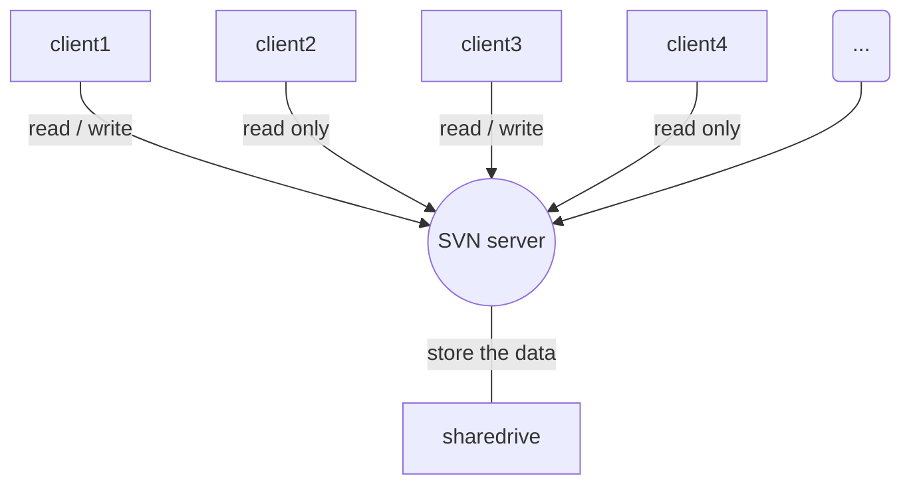

### 应用程序目录apps
+ main()
+ only include "board.h" and "radio.h"

### Lora芯片平台目录 radio
+ 同一个头文件 "radio.h" 定义统一的函数接口: extern const struct Radio_s Radio; //callback functions
+ 不同的平台代码接口（真正的写好程序），放在不同文件夹下面 ../sx1276, .../sx1272 

### system目录 
+ 定义了系统(MCU)统一的函数接口: uart.h, i2c.h, ...

### mac目录
+ LoRaWAN协议MAC层，纯逻辑: LoRaMacSendOnChannel() ...
+ 调用了radio.h 里面的接口函数,  
  e.g. LoRaMacSendFrameOnChannel()   
  {... Radio.Send( LoRaMacBuffer, LoRaMacBufferPktLen )}; ...

### boards目录
+ 非常重要，所有产品配置（硬件配置/软件固件配置）参数，接口都在此文件夹里面各个产品子目录配置。  
  包括子目录:  
             .../boards/Bleeper-72,  
             .../boards/Bleeper-76,  
             .../boards/LoRaMote,  
             .../boards/SensorNode,  
             .../boards/SK-iM880A
             
+ board.h 包含了所有需要引用的.h头文件，和板子引脚等的配置
+ LoRaMac-board.h 定义了Lora MAC层的相应的参数:  
  LORAMAC_MIN_DATARATE, LORAMAC_MAX_DATARATE, ...
+ sx1276-board.c 里面把芯片平台代码接口和radio.h里面的统一接口函数对应起来：  
  const struct Radio_s Radio =  
{  
    SX1276Init,  
    SX1276GetStatus,  
    SX1276SetModem,  
    SX1276SetChannel,  
    SX1276IsChannelFree,  
    SX1276Random,  
    SX1276SetRxConfig,  
    SX1276SetTxConfig,  
    SX1276CheckRfFrequency,  
    SX1276GetTimeOnAir,  
    SX1276Send,  
    SX1276SetSleep,  
    SX1276SetStby,   
    SX1276SetRx,  
    SX1276StartCad,  
    SX1276ReadRssi,  
    SX1276Write,  
    SX1276Read,  
    SX1276WriteBuffer,  
    SX1276ReadBuffer  
};  

### 最后总编译project的时候:
+ 选取想要的应用.../apps中某个子文件里面的主函数main()
+ 选取所用的模块板子 .../boards 里面某个子文件夹 "board.h"
+ 选取对应的Lora芯片平台("radio.h"): e.g. .../radio/sx1276/

---

